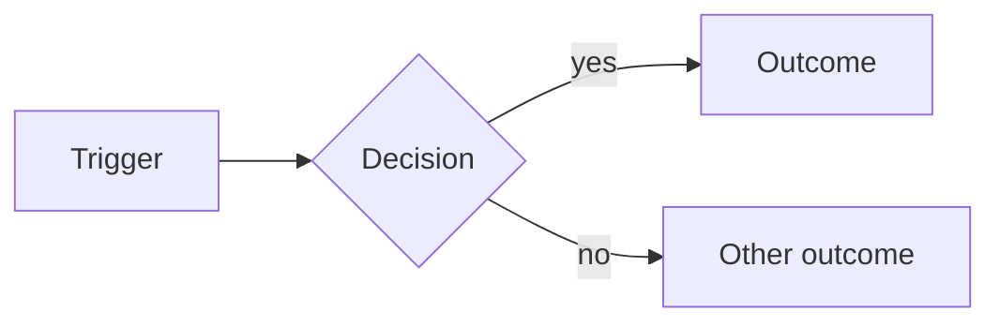

# Roadmap

Active project work lives in `ROADMAP.md` at the repo root. Completed items move to `ROADMAP_DONE.md` (use the `/roadmap-done` skill for that).

Always read `ROADMAP.md` before answering questions about priorities, current work, or dependencies.

## Status Vocabulary

Use exactly these values, lowercase, backtick-quoted:

| Status    | Meaning                                            |
| --------- | -------------------------------------------------- |
| `next`    | Queued or actively being worked on                 |
| `blocked` | Cannot proceed, waiting on an external dependency  |
| `freezer` | Deferred, spec or dependency missing               |
| `done`    | All acceptance criteria checked                    |

Do not invent statuses. There is no separate in-progress state: an item stays `next` while work happens on it. Use `blocked` only when work cannot continue, and record the reason in `Technical Notes`.

## When to Update

- **Blocked mid-flight** → set `Status` to `blocked` and add a `**Blocked:**` line to `Technical Notes`
- **Blocker cleared** → set `Status` back to `next` and remove the `**Blocked:**` line
- **Acceptance criterion met** → check the box `- [x]`
- **Test written and passing** → check its box in `### Tests`
- **All criteria and all tests checked** → set `Status` to `done`, then prompt user to run `/roadmap-done` to archive
- **Scope / Technical Notes / Acceptance Criteria change** → edit in the same commit as the code change
- **New item** → use the template below, assign next available `[NNN]` ID

## Assigning IDs

Scan both `ROADMAP.md` and `ROADMAP_DONE.md` for the highest `[NNN]`, then increment. Three-digit zero-padded. This scan is the only source of truth for the next ID.

Items appear in ascending ID order, oldest first: `[002]`, `[003]`, `[004]`. New items append to the end of `ROADMAP.md`. Never reorder by priority, status, or dependency, and never interleave IDs (`[003]`, `[002]`, `[004]` is wrong). If existing items are out of order, re-sort them ascending as part of the edit.

## Item Template

```markdown
## [NNN] Title

**Status:** `next`
**Depends On:** none | [NNN], [NNN]

### Goal

One-paragraph outcome.

### Scope

- Bulleted scope items
- What is explicitly NOT in scope

### Technical Notes

- Implementation details, commands, data, file paths



### Acceptance Criteria

- [ ] Checkable outcome
- [ ] Another outcome

### Tests

- [ ] `path/to/ExampleTest::it_does_the_thing`
- [ ] `path/to/ExampleTest::it_handles_the_edge_case`

## Diagrams in Technical Notes

Add a Mermaid diagram to `### Technical Notes` when the item involves structure that prose describes poorly:

| Shape | Diagram |
| --- | --- |
| Multi-step flow, branching logic, state transitions | `flowchart` or `stateDiagram-v2` |
| Request / job / actor ordering across boundaries | `sequenceDiagram` |
| Tables, models, relationships | `erDiagram` |
| Phased or dependency-chained delivery | `gantt` |

Rules:

- Fenced ```mermaid block, placed after the notes bullets
- One diagram per item, unless two genuinely distinct concerns exist
- Skip it for single-file changes, copy edits, config tweaks, and anything a sentence already covers. A diagram restating one bullet is noise
- Label edges when the branch condition matters
- Update the diagram in the same edit as the notes it illustrates. A stale diagram is worse than none

## Acceptance Criteria

Plain, checkable outcomes describing what is true when the item is finished. Written from the perspective of the result, not the implementation. Not every criterion has to be automatable, some are visual, editorial, or verified by hand.

## Tests

A separate `### Tests` section lists the automated tests that cover the item, written test-first.

- Write each test **before** the implementation and confirm it **fails** for the right reason. A test that passes on first run is either asserting nothing or asserting something already true
- Then implement until it passes
- Check the box when the test exists and passes
- Tests do not need to map one-to-one onto acceptance criteria. One test may cover several criteria, and one criterion may need several tests

When drafting a new item, name concrete test paths even though the files do not exist yet. The placeholder name is the specification.

An item is not `done` until every acceptance criterion **and** every test box is checked. If a criterion genuinely cannot be covered by an automated test (visual polish, copy, third-party behaviour), leave it out of `### Tests` and note how it was verified in `Technical Notes` rather than inventing a hollow assertion.

## Formatting Rules

- Items separated by `---` on its own line
- Bullet style: `- ` (dash + single space)
- IDs: `[NNN]` three-digit zero-padded (`[002]`, `[015]`), file ordered ascending, never interleaved
- One blank line between heading and `**Status:**` block
- Keep ordering: `Status` → `Depends On`
- Optional `**Spec:**` line may follow `Depends On` when a separate spec file exists

## Common Operations

**Add a new item:**

1. Read both `ROADMAP.md` and `ROADMAP_DONE.md`, find the highest `[NNN]`
2. Append a new item using the template, with the incremented ID
3. Separate from the previous item with `---`

**Work an item (test-first):**

1. Write the listed test and run it. Confirm it fails, and that it fails because the behaviour is missing rather than because of a typo or setup error
2. Implement until the test passes
3. Check the test box in `### Tests`
4. Check any acceptance criteria the work satisfies
5. When every box in **both** sections is checked, set `**Status:** `done`` and prompt: "All criteria met for [NNN]. Run /roadmap-done to archive?"

Do not check a test box on the strength of code existing. The observed pass is the evidence.

**Mark an item blocked:**

- Set `**Status:** `blocked``
- Append to `### Technical Notes`: `**Blocked:** <reason> (<date>)`
- Use `freezer` instead when the blocker is long-term or the spec does not exist yet
