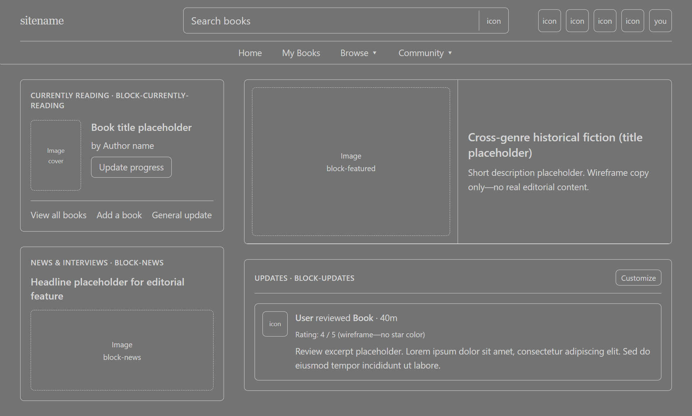

# ai

A collection of my AI resources. For my own use, YMMV.

## Sync `.cursor` from GitHub (sparse clone)

No overwrite:

`$repo='https://github.com/PSNapier/ai.git'; $tmp=Join-Path $env:TEMP ("ai-cursor-"+[guid]::NewGuid()); git clone --depth 1 --filter=blob:none --sparse $repo $tmp; git -C $tmp sparse-checkout set cursor; robocopy (Join-Path $tmp 'cursor') (Join-Path (Get-Location) '.cursor') /E /XC /XN /XO /R:1 /W:1; if($LASTEXITCODE -ge 8){ throw "robocopy failed: $LASTEXITCODE" }; Remove-Item $tmp -Recurse -Force`

With overwrite:

`$repo='https://github.com/PSNapier/ai.git'; $tmp=Join-Path $env:TEMP ("ai-cursor-"+[guid]::NewGuid()); git clone --depth 1 --filter=blob:none --sparse $repo $tmp; git -C $tmp sparse-checkout set cursor; robocopy (Join-Path $tmp 'cursor') (Join-Path (Get-Location) '.cursor') /E /IS /IT /R:1 /W:1; if($LASTEXITCODE -ge 8){ throw "robocopy failed: $LASTEXITCODE" }; Remove-Item $tmp -Recurse -Force`

## Rules (`.cursor/rules/`)

### `caveman.mdc`

**`.cursor/rules/caveman.mdc`** is **always on**: terse replies (drop filler and hedging; fragments OK) while keeping technical accuracy. Switch intensity with `/caveman` (lite, full, ultra; the **caveman** skill adds wenyan modes). Say `stop caveman` or `normal mode` to turn off. For security warnings, irreversible actions, or when you are lost, the model should drop caveman briefly, then resume.

_Note: this has been widely passed around as some sort of token efficiency boon... since it's been tested more it doesn't actually appear to be that. However, I've enjoyed having it for the less verbose output it forces._

## Skills (`.cursor/skills/<name>/SKILL.md`)

### `/audit-plan` (custom)

Reviews plans, specs, or guidelines for flaws, ways to simplify, edge cases, performance risks, and security gaps. Invoke with `/audit-plan` or by asking for a critical read of a plan. Output can stay shallow (headlines + severity) or go deep if you ask.

### `/grill-plan` (custom)

Pressure-tests a plan with one focused question at a time (often multiple choice), following a set order from goals and scope through failure modes, security, scaling, and tests. Ends with locked decisions and remaining risks. Use `/grill-plan` or ask to stress-test a plan before build.

### `/frontend-wireframe` (custom)

Layout and UX-only wireframes: two fixed Tailwind neutrals, border-only blocks, stable `block-*` / region names, mobile-first layout and `xl` desktop shell. Infer Vue/Blade/Inertia from the repo. Reference URLs or screenshots inform **structure** only—ignore real colors, fonts, and brand art unless you override.

Example target layout (book-community style homepage: header, sidebar blocks, featured + updates feed):

### `/frontend-implementation` (custom)

Production UI aligned with this repo’s stack: small color palette (3–5), at most two font families, mobile-first Tailwind, design tokens in `app.css`, SEO via Inertia `Head` + root Blade, accessibility and form patterns for Laravel + Inertia. Use when shipping or refactoring real UI.

### `/startup-design`

Takes an idea through eight phases: intake, brainstorm, research, strategy, brand, product, financials, validation—mostly as markdown artifacts plus `PROGRESS.md` for resuming. Optional fast-track when you want a quicker go/no-go. Supporting material lives under `startup-design/references/` (research waves, synthesis, benchmarks, honesty protocol, etc.).

### `/caveman`

Invocable skill that matches the **caveman** rules and adds modes like **wenyan** and explicit persistence rules. Use when you want the same terse style with the full option set documented in the skill.
